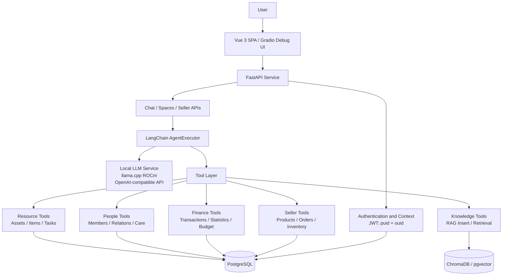

# UR-Agent (Uni-Resource Agent) Project Specification Document

## 1. Project overview

**UR-Agent (Uni-Resource Agent)** is a locally deployed private AI resource management assistant for individuals, families, small organizations, and business operations. Its core idea is **Everything is a Resource**: assets, knowledge, people, financial records, products, orders, and tasks are represented as resources that an Agent can understand, retrieve, orchestrate, and operate on.

This project is submitted to **2026 AMD AI DevMaster Hackathon - Track 2: Development & Local Deployment of Private AI Agents**. The core inference path runs locally on AMD Radeon GPU + ROCm. A llama.cpp ROCm backend exposes a local OpenAI-compatible API, so organization, family, and business data do not need to be sent to a remote closed Agent platform.

| Field | Value |
| :--- | :--- |
| Application name | UR-Agent (Uni-Resource Agent) |
| Applicant | qiancy |
| AMD Developer Program No. | 00000657 |
| Source repository | https://github.com/qiancy/ur-agent |
| Production demo website | https://rc-e2369faa1fa45132.radeon.firstdg.ai |
| Local demo service | http://127.0.0.1:5173 |
| License | MIT |
| Track | Track 2: Development & Local Deployment of Private AI Agents |
| Technology stack | LangChain, llama.cpp ROCm, FastAPI, PostgreSQL, pgvector, ChromaDB, Gradio, Vue 3 |

## 2. Application scenarios

UR-Agent is designed for users who need to manage multiple context spaces at the same time, such as a personal space, a family space, a small business space, a temporary project space, and an e-commerce seller space. Each space has its own people, knowledge, assets, transactions, and tool permissions. A user can switch between spaces and let the same local Agent work under different roles without mixing data.

Typical scenarios include:

- **Personal resource management**: manage devices, documents, learning materials, todos, and personal knowledge.
- **Family collaboration assistant**: manage family assets, family member tasks, education materials, and daily plans.
- **Small organization assistant**: organize assets, member responsibilities, internal documents, and financial records.
- **Local knowledge base Q&A**: store documents, notes, and project materials locally, then retrieve them during conversations.
- **Seller workbench**: query and analyze products, inventory, orders, customers, and business data.

UR-Agent is not intended to be only a generic chatbot. It is an operational Agent that understands resource relationships in a private environment.

## 3. Agent architecture diagram



Architecture highlights:

- **Local model layer**: AMD Radeon GPU + ROCm runs llama.cpp and provides a local OpenAI-compatible `/v1` endpoint.
- **Agent orchestration layer**: LangChain AgentExecutor interprets natural language, decomposes tasks, and invokes tools.
- **Tool layer**: resource, knowledge, people, finance, and Seller capabilities are exposed as controlled tools.
- **Data layer**: PostgreSQL stores structured data; ChromaDB or pgvector supports vector retrieval.
- **Permission context layer**: JWT carries `puid` and `ouid`; every request is bound to a user and an organization/context space.
- **Interaction layer**: Vue 3 SPA is the product interface; Gradio is used for quick debugging and demos.

## 4. Introduction to core capabilities

### 4.1 Local Knowledge Retrieval (RAG)

UR-Agent can write organization or personal knowledge into a local knowledge base and retrieve it with per-space isolation. When answering a question, the Agent first retrieves relevant content from the knowledge collection associated with the current `ouid`, then generates an answer with the local model.

Value:

- Private materials stay in the local environment.
- Knowledge from different organization spaces does not contaminate each other.
- The same mechanism can manage project notes, manuals, family documents, product data, and FAQs.

### 4.2 Tool Calling

Business capabilities are exposed as tools, such as resource search, knowledge insertion, knowledge retrieval, people lookup, financial analysis, and Seller workbench operations. The Agent selects tools based on the user's request instead of relying only on free-form model generation.

Example tasks:

- "Find high-value assets in the current space and group them by status."
- "Store this project description in the knowledge base and summarize three risks."
- "Analyze recent orders and inventory, then list products that need replenishment."

### 4.3 Multi-Step Task Planning

For compound requests, the Agent decomposes the goal into multiple steps, such as retrieving knowledge, querying structured data, and generating a summary or action plan. This is useful for workflows that require finding evidence, making judgments, and producing an actionable checklist.

Example:

1. The user asks, "How is the business doing this month, and what are the risks?"
2. The Agent calls finance or Seller tools to read orders, inventory, and transaction records.
3. The Agent retrieves business rules or campaign plans from the knowledge base.
4. The Agent summarizes revenue, anomalies, and recommended actions.

### 4.4 Local Multi-Turn Memory

UR-Agent retains conversation context within a session. A user can ask an initial question and then continue with follow-ups such as "What about the family space?", "Only show products below the inventory threshold", or "Turn the conclusion into meeting notes." The Agent continues from the current conversation and current space context.

### 4.5 Permission Control and Privacy Protection

The system uses `puid` to identify a person and `ouid` to identify an organization or context space. JWT carries only the necessary identity context. The backend binds every request to the current user and space, and tool calls are scoped accordingly to prevent cross-space data access.

Privacy strategy:

- Core inference runs on local AMD Radeon GPU and does not depend on a remote closed Agent platform.
- Structured data and vector knowledge bases stay in the local or private environment.
- Tool calls are filtered by context space to avoid data leakage between personal, family, and business spaces.
- Demo recordings and submission materials should not expose keys, tokens, database passwords, or real private data.

## 5. Model introduction & local deployment plan

### 5.1 Model and inference service

UR-Agent uses a local Qwen-family model as the Agent reasoning model. GGUF quantization reduces VRAM usage and makes local deployment more practical. The production demo uses `llamaserver.sh` to manage the llama.cpp service.

| Purpose | Recommended model | Deployment |
| :--- | :--- | :--- |
| Production demo model | Qwen3-Coder-30B-A3B GGUF Q4_K_M | llama.cpp ROCm with AMD Radeon GPU acceleration |
| Higher-quality fallback | Qwen3-Coder-Next 80B GGUF Q5_K_M | Use when enough VRAM is available |
| Chinese embedding retrieval | BAAI/bge-large-zh-v1.5 or a comparable embedding model | Local embedding service, persisted to ChromaDB or pgvector |

llama.cpp runs as an OpenAI-compatible local API:

```text
http://127.0.0.1:8080/v1
```

The FastAPI backend treats this local service as a standard LLM endpoint, so the Agent code is not tied to a specific cloud vendor.

The production llama.cpp launch configuration comes from `/data/research/amd.com/unires/unires-service/llamacpp/scripts/llamaserver.sh`:

| Parameter | Value |
| :--- | :--- |
| Model directory | `/data/data-store/llamacpp/models/Qwen3-Coder-30B-A3B-Q4_K_M` |
| Model file | `qwen3-coder-30b-a3b-instruct-q4_k_m.gguf` |
| Listen address | `0.0.0.0:8080` |
| OpenAI-compatible endpoint | `http://127.0.0.1:8080/v1` |
| GPU layers | `-ngl -1`, offloading all possible model layers to GPU |
| Context size | `524288` tokens |
| Parallel slots | `2` |
| KV cache | `K=q4_0`, `V=q4_0` |
| CPU threads | `-t 64`, `--threads-batch 64` |
| NUMA | `--numa distribute` |
| Acceleration flags | `--flash-attn on`, `--cache-prompt`, `--op-offload`, `--jinja`, `--no-webui` |
| Model alias | `qwen3` |
| Launch-script performance hint | `~35 tok/s`, `~19 GB GPU model + ~13 GB KV` |

### 5.2 Local deployment steps

Reviewers can reproduce the project with the following flow:

1. Prepare an AMD Radeon GPU and ROCm environment; verify `rocminfo` and `rocm-smi`.
2. Build or install llama.cpp with ROCm/HIPBLAS support.
3. Download the Qwen GGUF quantized model to a local model directory.
4. Start the llama.cpp server on `127.0.0.1:8080`.
5. Install PostgreSQL 16 and pgvector; create the `unires` database and vector extension.
6. Install Python dependencies and start the FastAPI backend.
7. Start the Vue 3 SPA or Gradio debug interface.
8. Validate RAG, tool calling, multi-turn conversation, and space isolation with demo data.

The current production demo website is:

```text
https://rc-e2369faa1fa45132.radeon.firstdg.ai
```

The local frontend service behind the tunnel is:

```text
http://127.0.0.1:5173
```

### 5.3 Production runtime environment

The current production demo runs in an AMD Radeon GPU + ROCm Pod environment. Resource information comes from `/data/research/amd.com/unires/unires-docs/resources.md`.

| Component | Production configuration |
| :--- | :--- |
| Hostname | `u-4054-4d0e3f1c` |
| OS | Ubuntu 24.04.4 LTS (Noble Numbat) |
| Kernel | `6.8.0-79-generic` |
| CPU | Dual AMD EPYC 9334 32-Core Processor, 64 cores / 128 threads |
| Memory | 503 GB total |
| GPU | AMD Radeon Graphics |
| GPU VRAM | 49136 MB |
| ROCm | 7.2.1 |
| amdgpu | 6.16.13 |
| AMD-SMI | 26.2.2 |
| Storage | `/workspace` PVC, 98 GB total with about 16 GB available; `/data` is a symlink to `/workspace` |
| Runtime | Kubernetes Pod, containerd, overlay container layer |
| Python | 3.11 |
| Backend | FastAPI, LangChain |
| Database | PostgreSQL 16 + pgvector |
| Vector store | ChromaDB or pgvector |
| Frontend | Vue 3 + Vite + TypeScript |

## 6. Optimization description for inference speed on AMD Radeon GPU

UR-Agent optimizes for usable local Agent latency while controlling VRAM usage and context length.

### 6.1 Model quantization and VRAM control

- Use Qwen3-Coder-30B-A3B GGUF Q4_K_M as the production demo model.
- Switch to Q5_K_M or higher precision when more VRAM is available and higher reasoning quality is needed.
- Start llama.cpp with `-ngl -1` to offload all possible model layers to AMD Radeon GPU.
- Configure a `524288` token context window, `2` parallel slots, and `q4_0` KV cache compression.
- Enable `--flash-attn on`, `--cache-prompt`, and `--op-offload` to reduce repeated prompt cost and improve GPU inference efficiency.
- Use `--numa distribute`, `-t 64`, and `--threads-batch 64` to match the dual EPYC 9334 / 128-thread server.

### 6.2 Agent context trimming

- Load only current-space data according to the `ouid` in the JWT.
- Tool results return only fields needed for the task, instead of injecting full database records into the prompt.
- RAG retrieval controls top-k and chunk length, passing only locally relevant evidence to the model.

### 6.3 Data retrieval optimization

- PostgreSQL stores structured resources, people, finance records, orders, and other business data.
- pgvector uses HNSW or IVFFlat indexes for vector search acceleration.
- ChromaDB maintains collections by organization/context space to reduce cross-space retrieval noise.

### 6.4 Production deployment metrics

The following values come from the production resource document and llama.cpp launch script. `~35 tok/s` is the launch-script performance hint; the final demo video can verify it with the `timings.predicted_per_second` field returned by `/v1/chat/completions`.

| Metric | Value |
| :--- | :--- |
| GPU model | AMD Radeon Graphics |
| GPU VRAM | 49136 MB |
| ROCm version | 7.2.1 |
| Model file | `qwen3-coder-30b-a3b-instruct-q4_k_m.gguf` |
| Quantization | Q4_K_M |
| Context length | 524288 tokens |
| Parallel slots | 2 |
| llama.cpp startup parameters | `-ngl -1 -c 524288 -np 2 --cache-type-k q4_0 --cache-type-v q4_0 --flash-attn on --cache-prompt --op-offload --numa distribute -t 64 --threads-batch 64` |
| VRAM usage | Launch script hint: about 19 GB model VRAM + 13 GB KV cache |
| First-token latency | To be measured in the demo video |
| Average generation speed, tokens/s | Launch script hint: about 35 tok/s, to be verified in the demo video |
| End-to-end time for RAG + tool calling | To be measured in the demo video |

## 7. Demo workflow summary

The demo video should be 3 to 5 minutes:

1. Show AMD Radeon GPU and ROCm status.
2. Start the local llama.cpp ROCm model service.
3. Start the UR-Agent backend and frontend.
4. Insert knowledge in one space and ask a RAG question.
5. Run a multi-step tool calling task, such as querying resources and producing an action plan.
6. Switch to another space and prove permission isolation.
7. Show generation speed and logs to demonstrate that core inference runs locally on AMD Radeon GPU.

## 8. Innovation and value

- **Unified resource abstraction**: personal, family, organization, and seller objects are represented as resources that an Agent can understand and operate on.
- **Multi-context space isolation**: one person can work across multiple identities and organization spaces with clear data boundaries.
- **Private local deployment**: core inference, knowledge base, and business data can run in a local environment.
- **Tool-oriented Agent design**: the Agent reads and writes real resource data through tools, making it closer to a practical productivity and business assistant.
- **AMD Radeon GPU adaptation**: ROCm and llama.cpp place local model inference on AMD Radeon GPU, matching the focus of Track 2.

## 9. Submission material references

- Source repository: https://github.com/qiancy/ur-agent
- Production demo website: https://rc-e2369faa1fa45132.radeon.firstdg.ai
- Submission checklist: `submission-checklist.md`
- Demo storyboard: `DemoVideo/storyboard.md`
- PPT outline: `SupplementaryMaterials/PPT/outline.md`
- License: MIT
