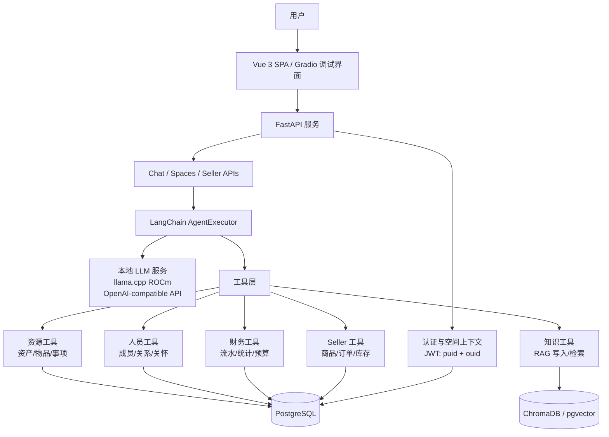

# UR-Agent (Uni-Resource Agent) 项目说明文档

> 中文工作稿。最终提交到比赛 Pull Request 前，建议同步准备英文版或导出英文 PDF。

## 1. 项目概览

**UR-Agent (Uni-Resource Agent)** 是一个面向个人、家庭、小型组织和业务场景的本地私有 AI 资源管理助手。项目核心理念是 **Everything is a Resource**：把资产、知识、人员、财务流水、商品和任务都抽象为可被 Agent 理解、检索、编排和执行的资源。

本项目参加 **2026 AMD AI DevMaster 黑客松 Track 2: 私有 AI Agent 开发与本地部署**。核心推理链路部署在 AMD Radeon GPU + ROCm 环境中，通过 llama.cpp ROCm 后端提供本地 OpenAI-compatible 模型接口，避免把组织数据、家庭数据和业务数据发送到远程闭源 Agent 平台。

| 项目 | 内容 |
| :--- | :--- |
| 应用名称 | UR-Agent (Uni-Resource Agent) |
| 参赛者 | qiancy |
| AMD Developer Program No. | 00000657 |
| 源码仓库 | https://github.com/qiancy/ur-agent |
| 生产环境 Demo 网站 | https://rc-e2369faa1fa45132.radeon.firstdg.ai |
| 本地 Demo 服务 | http://127.0.0.1:5173 |
| License | MIT |
| 赛道 | Track 2: 私有 AI Agent 开发与本地部署 |
| 技术栈 | LangChain、llama.cpp ROCm、FastAPI、PostgreSQL、pgvector、ChromaDB、Gradio、Vue 3 |

## 2. Application scenarios / 应用场景

UR-Agent 面向同一个用户同时管理多个“上下文空间”的需求，例如个人空间、家庭空间、小型企业空间、临时项目空间和电商经营空间。每个空间有独立的人员、知识、资产、交易和工具权限，用户可以在不同空间之间切换，让同一个本地 Agent 在不同角色下工作，但不混用数据。

典型场景包括：

- **个人资源管理**：记录设备、证件、学习资料、待办事项和个人知识。
- **家庭协作助手**：管理家庭资产、家庭成员事项、教育资料和日常计划。
- **小型组织助手**：整理组织资产、成员职责、文档知识库和财务流水。
- **本地知识库问答**：将文档、笔记、项目资料写入知识库，并在对话中做 RAG 检索。
- **Seller 工作台**：面向商品、库存、订单、客户和经营数据执行查询与分析。

UR-Agent 的目标不是做一个泛用聊天机器人，而是做一个能在私有环境中理解“资源关系”的操作型 Agent。

## 3. Agent architecture diagram / Agent 架构图



架构要点：

- **本地模型层**：AMD Radeon GPU + ROCm 运行 llama.cpp，提供本地 OpenAI-compatible `/v1` 接口。
- **Agent 编排层**：LangChain AgentExecutor 负责理解自然语言、拆解任务和调用工具。
- **工具层**：将资源、知识、人员、财务和 Seller 场景封装为受控工具。
- **数据层**：PostgreSQL 存储结构化数据，ChromaDB 或 pgvector 支撑向量检索。
- **权限上下文层**：JWT 中携带 `puid` 与 `ouid`，每次请求都绑定用户和组织空间。
- **交互层**：Vue 3 SPA 作为正式产品界面，Gradio 作为快速调试和演示入口。

## 4. Introduction to core capabilities / 核心能力介绍

### 4.1 本地知识检索 RAG

UR-Agent 支持把组织或个人知识写入本地知识库，并按空间进行隔离检索。Agent 在回答问题时优先从当前 `ouid` 对应的知识集合中检索内容，再结合本地模型生成答案。

价值：

- 私有资料不离开本地环境。
- 不同组织空间的知识不会相互污染。
- 适合管理项目笔记、说明文档、家庭资料、商品资料和 FAQ。

### 4.2 工具调用

系统将业务能力封装为工具，例如资源查询、知识写入、知识检索、人员查询、财务流水分析和 Seller 工作台操作。Agent 可以根据用户问题选择工具，而不是只依赖语言模型自由生成。

示例任务：

- “查一下当前空间里有哪些高价值资产，并按状态分组。”
- “把这段项目说明存入知识库，并总结三条风险。”
- “分析最近订单和库存，给出需要补货的商品。”

### 4.3 多步骤任务规划

当用户提出复合任务时，Agent 会将目标拆成多个步骤，例如先检索知识，再查询结构化数据，最后生成总结或建议。该能力适合处理“先找资料，再做判断，再输出行动清单”的工作流。

示例：

1. 用户询问“这个月经营情况怎么样，有哪些风险？”
2. Agent 调用财务或 Seller 工具读取订单、库存和流水。
3. Agent 检索知识库中的经营规则或活动计划。
4. Agent 汇总收入、异常项和行动建议。

### 4.4 本地多轮记忆

UR-Agent 支持在会话中保留上下文。用户可以先提出一个任务，再连续追问“那家庭空间呢”“只看库存低于阈值的商品”“把结论整理成会议纪要”。Agent 会结合当前会话与当前空间继续执行。

### 4.5 权限控制与隐私保护

系统通过 `puid` 标识人员，通过 `ouid` 标识组织或空间。JWT 只携带必要身份上下文，后端在每次请求中执行空间绑定和工具权限约束，防止跨空间读取数据。

隐私策略：

- 核心推理过程走本地 AMD Radeon GPU，不依赖远程闭源 Agent 平台。
- 结构化数据和向量知识库均保存在本地或私有环境。
- 工具调用按空间过滤，避免个人、家庭和企业数据串线。
- 视频录制和提交材料中不展示密钥、token、数据库密码和真实隐私数据。

## 5. Model introduction & local deployment plan / 模型介绍与本地部署方案

### 5.1 模型与推理服务

本项目使用 Qwen 系列本地大模型作为 Agent 推理模型，并通过 GGUF 量化降低显存占用。当前生产 Demo 使用 `llamaserver.sh` 统一管理 llama.cpp 服务，主模型配置如下：

| 用途 | 推荐模型 | 部署方式 |
| :--- | :--- | :--- |
| 生产 Demo 主模型 | Qwen3-Coder-30B-A3B GGUF Q4_K_M | llama.cpp ROCm，AMD Radeon GPU 加速 |
| 高质量备选模型 | Qwen3-Coder-Next 80B GGUF Q5_K_M | 显存充足时使用 |
| 中文向量检索 | BAAI/bge-large-zh-v1.5 或同类 embedding 模型 | 本地 embedding 服务，写入 ChromaDB 或 pgvector |

llama.cpp 以 OpenAI-compatible API 方式运行：

```text
http://127.0.0.1:8080/v1
```

FastAPI 后端将该本地模型服务视为标准 LLM endpoint，Agent 代码不需要绑定具体云厂商接口。

生产环境 llama.cpp 启动配置来自 `/data/research/amd.com/unires/unires-service/llamacpp/scripts/llamaserver.sh`：

| 参数 | 值 |
| :--- | :--- |
| 模型目录 | `/data/data-store/llamacpp/models/Qwen3-Coder-30B-A3B-Q4_K_M` |
| 模型文件 | `qwen3-coder-30b-a3b-instruct-q4_k_m.gguf` |
| 服务监听 | `0.0.0.0:8080` |
| OpenAI-compatible endpoint | `http://127.0.0.1:8080/v1` |
| GPU layers | `-ngl -1`，尽量将全部模型层 offload 到 GPU |
| Context size | `524288` tokens |
| Parallel slots | `2` |
| KV cache | `K=q4_0`, `V=q4_0` |
| CPU threads | `-t 64`, `--threads-batch 64` |
| NUMA | `--numa distribute` |
| 加速参数 | `--flash-attn on`, `--cache-prompt`, `--op-offload`, `--jinja`, `--no-webui` |
| 模型别名 | `qwen3` |
| 启动脚本性能提示 | `~35 tok/s`, `~19 GB GPU 模型 + ~13 GB KV` |

当前生产环境 Demo 网站：

```text
https://rc-e2369faa1fa45132.radeon.firstdg.ai
```

本地前端服务：

```text
http://127.0.0.1:5173
```

### 5.2 本地部署步骤

评审环境可按以下流程复现：

1. 准备 AMD Radeon GPU 与 ROCm 环境，确认 `rocminfo`、`rocm-smi` 可用。
2. 编译或安装支持 ROCm/HIPBLAS 的 llama.cpp。
3. 下载 Qwen GGUF 量化模型到本地模型目录。
4. 启动 llama.cpp server，并监听 `127.0.0.1:8080`。
5. 安装 PostgreSQL 16 与 pgvector，创建 `unires` 数据库和向量扩展。
6. 安装 Python 依赖，启动 FastAPI 后端。
7. 启动 Vue 3 SPA 或 Gradio 调试界面。
8. 使用演示数据验证 RAG、工具调用、多轮对话和空间隔离。

### 5.3 生产运行环境

当前生产 Demo 运行在 AMD Radeon GPU + ROCm Pod 环境中，资源信息来自 `/data/research/amd.com/unires/unires-docs/resources.md`：

| 组件 | 生产环境配置 |
| :--- | :--- |
| Hostname | `u-4054-4d0e3f1c` |
| OS | Ubuntu 24.04.4 LTS (Noble Numbat) |
| Kernel | `6.8.0-79-generic` |
| CPU | Dual AMD EPYC 9334 32-Core Processor，64 cores / 128 threads |
| Memory | 503 GB total |
| GPU | AMD Radeon Graphics |
| GPU VRAM | 49136 MB |
| ROCm | 7.2.1 |
| amdgpu | 6.16.13 |
| AMD-SMI | 26.2.2 |
| Storage | `/workspace` PVC，98 GB，总量中约 16 GB 可用；`/data` 为 `/workspace` 软链接 |
| Runtime | Kubernetes Pod，containerd，overlay container layer |
| Python | 3.11 |
| 后端 | FastAPI、LangChain |
| 数据库 | PostgreSQL 16 + pgvector |
| 向量库 | ChromaDB 或 pgvector |
| 前端 | Vue 3 + Vite + TypeScript |

## 6. Optimization description for inference speed on AMD Radeon GPU / AMD Radeon GPU 推理速度优化说明

UR-Agent 的优化目标是让私有 Agent 在本地 GPU 上保持可用响应速度，同时控制显存占用和上下文长度。

### 6.1 模型量化与显存控制

- 使用 Qwen3-Coder-30B-A3B GGUF Q4_K_M 作为生产 Demo 主模型。
- 在显存更充足的环境中切换到 Q5_K_M 或更高精度模型，提高复杂推理质量。
- llama.cpp 使用 `-ngl -1`，尽量将全部模型层 offload 到 AMD Radeon GPU。
- 上下文窗口配置为 `524288` tokens，并发 slot 为 `2`，KV cache 使用 `q4_0` 压缩。
- 启用 `--flash-attn on`、`--cache-prompt` 和 `--op-offload`，降低重复 prompt 成本并提升 GPU 推理效率。
- 使用 `--numa distribute`、`-t 64`、`--threads-batch 64` 适配双路 EPYC 9334 / 128 线程服务器。

### 6.2 Agent 上下文裁剪

- 根据 JWT 中的 `ouid` 只加载当前空间数据，减少无关上下文。
- 工具层只返回完成任务所需字段，避免把完整数据库记录塞入 prompt。
- RAG 检索控制 top-k 和片段长度，优先传入命中的局部知识。

### 6.3 数据检索优化

- PostgreSQL 存储结构化资源、人员、财务、订单等数据。
- pgvector 使用 HNSW 或 IVFFlat 索引加速向量检索。
- ChromaDB 按组织空间维护 collection，降低跨空间检索噪声。

### 6.4 生产部署指标

以下指标来自生产资源文档和 llama.cpp 启动脚本。`~35 tok/s` 是启动脚本中的性能提示，最终演示视频可再用 `/v1/chat/completions` 返回的 `timings.predicted_per_second` 做现场验证。

| 指标 | 记录值 |
| :--- | :--- |
| GPU 型号 | AMD Radeon Graphics |
| GPU VRAM | 49136 MB |
| ROCm 版本 | 7.2.1 |
| 模型文件 | `qwen3-coder-30b-a3b-instruct-q4_k_m.gguf` |
| 量化等级 | Q4_K_M |
| 上下文长度 | 524288 tokens |
| 并发 slot | 2 |
| llama.cpp 启动参数 | `-ngl -1 -c 524288 -np 2 --cache-type-k q4_0 --cache-type-v q4_0 --flash-attn on --cache-prompt --op-offload --numa distribute -t 64 --threads-batch 64` |
| 显存占用 | 启动脚本提示约 19 GB 模型显存 + 13 GB KV cache |
| 首 token 延迟 | 待视频实测 |
| 平均生成速度 tokens/s | 启动脚本提示约 35 tok/s，待视频实测确认 |
| RAG + 工具调用端到端耗时 | 待视频实测 |

## 7. 演示流程摘要

演示视频建议控制在 3 到 5 分钟：

1. 展示 AMD Radeon GPU 与 ROCm 状态。
2. 启动本地 llama.cpp ROCm 模型服务。
3. 启动 UR-Agent 后端和前端。
4. 在一个空间中演示知识写入和 RAG 问答。
5. 演示一个多步骤工具调用任务，例如查询资源并生成行动清单。
6. 切换到另一个空间，证明数据隔离和权限控制。
7. 展示推理速度和日志，说明核心推理在本地 AMD Radeon GPU 上完成。

## 8. 创新点与价值

- **统一资源抽象**：把家庭、个人、组织、电商经营中的多类对象统一为资源，方便 Agent 理解和操作。
- **多上下文空间隔离**：同一个人可以在多个身份和组织空间中工作，数据边界清晰。
- **本地私有部署**：核心推理、知识库和业务数据都可在本地环境运行，适合隐私敏感场景。
- **工具化而非纯聊天**：Agent 通过工具读写真实资源数据，更接近可落地的办公和经营助手。
- **适配 AMD Radeon GPU**：使用 ROCm 和 llama.cpp 将模型推理放到本地 GPU 上，体现比赛赛道重点。

## 9. 提交材料引用

- 源码仓库：https://github.com/qiancy/ur-agent
- 提交清单：`submission-checklist_cn.md`
- 生产环境 Demo：https://rc-e2369faa1fa45132.radeon.firstdg.ai
- 演示视频脚本：`DemoVideo/storyboard_cn.md`
- PPT 大纲：`SupplementaryMaterials/PPT/outline_cn.md`
- License：MIT
